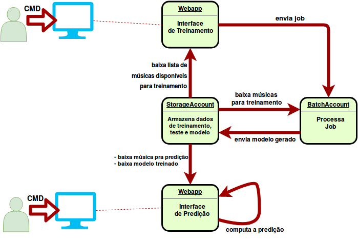

This repo contains the code used in the Khomp Talk about how to deploy Webapp and do workload using the Azure resources.

The system scheme is presented in the figure bellow.

The presentation can be checked [here](helpers/AzurePresentation.pdf).

The Azure main CLI commands can be found [here](helpers/deploy.sh), and there are templates of json-file to create [jobs](app.api.train/job_template.json) and [pools](helpers/pool.json).

Others dockerfiles used to help the apps are present in `helpers/`.
